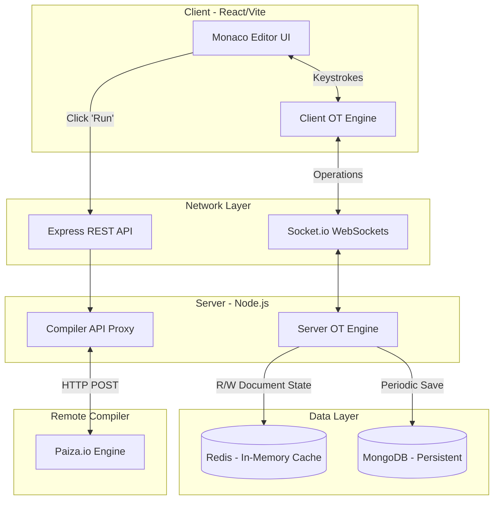

<h1 align="center">⚡ MaxHeap — Real-Time Collaborative Code Editor</h1>

<p align="center">
  
  
  
  
  
</p>

> A high-performance, real-time collaborative code editor modeled after Google Docs for code. It supports real-time synchronization using Operational Transformation (OT), multi-cursor tracking, and live remote code execution for 7 programming languages.

## ✨ Core Features
- **Real-Time Collaboration:** Multiple users can type simultaneously with zero latency.
- **Operational Transformation (OT):** Custom-built mathematical OT engine guarantees eventual consistency and prevents document corruption during concurrent typing collisions.
- **Multi-Cursor Tracking:** Live presence of all connected users with remote cursor indicators.
- **Remote Code Execution:** Secure, containerized remote execution for C++, Java, Python, JavaScript, TypeScript, Go, and Rust.
- **Dual-Tier Storage System:** High-throughput in-memory state caching (Redis) paired with persistent session storage (MongoDB).

---

## 🏗 System Architecture

The system is designed to handle high-frequency events (keystrokes and cursor movements) efficiently without overwhelming the database disk I/O. 



---

## 🧠 Deep Dive: Operational Transformation (OT)

Handling simultaneous text edits over a network is a notorious distributed systems problem. If User A and User B type at the exact same index at the exact same time, basic synchronization will fail and their documents will diverge permanently.

To solve this, MaxHeap utilizes **Operational Transformation**:
1. **Mathematical Operations:** Instead of transmitting raw text, the client transmits operations (e.g., `insert 'X' at index 5`).
2. **Server Authority & Queuing:** Operations are funneled through an async queue per room to prevent race conditions during Redis Read/Writes.
3. **Deterministic Tiebreaking:** When concurrent inserts collide at the exact same index, the OT algorithm uses the `socket.id` (a guaranteed unique identifier) to deterministically sort the operations lexicographically.
4. **Broadcast & Convergence:** The server shifts the losing operation's index by `+1`, applies the text to Redis, and broadcasts the transformed operation. All clients apply the exact same mathematical shifts locally, ensuring 100% data convergence.

---

## 🚀 Getting Started

### Prerequisites
- Node.js (v18+)
- Redis (running on default port 6379)
- MongoDB (running locally or via Atlas)

### Installation

1. **Clone the repository**
   ```bash
   git clone https://github.com/YourUsername/maxheap-collaborative-editor.git
   cd maxheap-collaborative-editor
   ```

2. **Setup the Server**
   ```bash
   cd server
   npm install
   
   # Create a .env file and add your MongoDB URI:
   # MONGO_URI=mongodb://localhost:27017/maxheap
   
   npm run dev
   ```

3. **Setup the Client**
   Open a new terminal and navigate to the client folder:
   ```bash
   cd client
   npm install
   npm run dev
   ```

4. **Open the App**
   Visit `http://localhost:5173` in your browser. Copy the Room URL and open it in a second window or an incognito tab to test the real-time collaboration.

---

## 🛠 Tech Stack Details
* **Frontend UI:** React, Monaco Editor (VS Code Engine)
* **Real-time Protocol:** WebSockets via Socket.io
* **Backend:** Node.js, Express
* **Database & Caching:** Redis (State/Session Management), MongoDB (Permanent Storage)
* **Compilation API:** Paiza.io

## 📝 License
This project is open-source and available under the MIT License.
